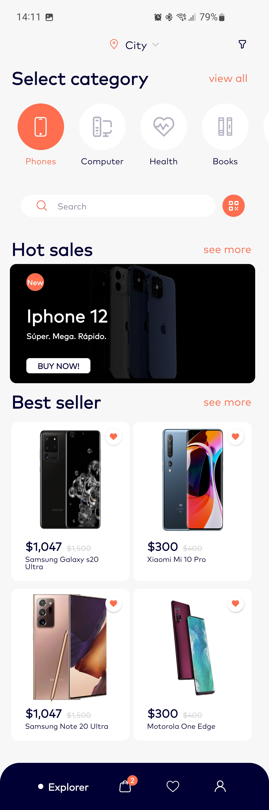

# Ecommerce Concept

Тестовое задание для Effective Mobile

### Cтек:
- Kotlin
- MVVM
- Clean Architecture
- Многомодульность
- LiveData
- Dagger2
- RxJava3
- OkHttp3
- Retrofit2
- Picasso
- AdapterDelegates
- AndroidX Navigation

## Экраны
| Figma                                                                                                                              | Моё приложение                                                                                                             |
|------------------------------------------------------------------------------------------------------------------------------------|----------------------------------------------------------------------------------------------------------------------------|
|  |  |
|        |        |
|     |     |
|              |              |
